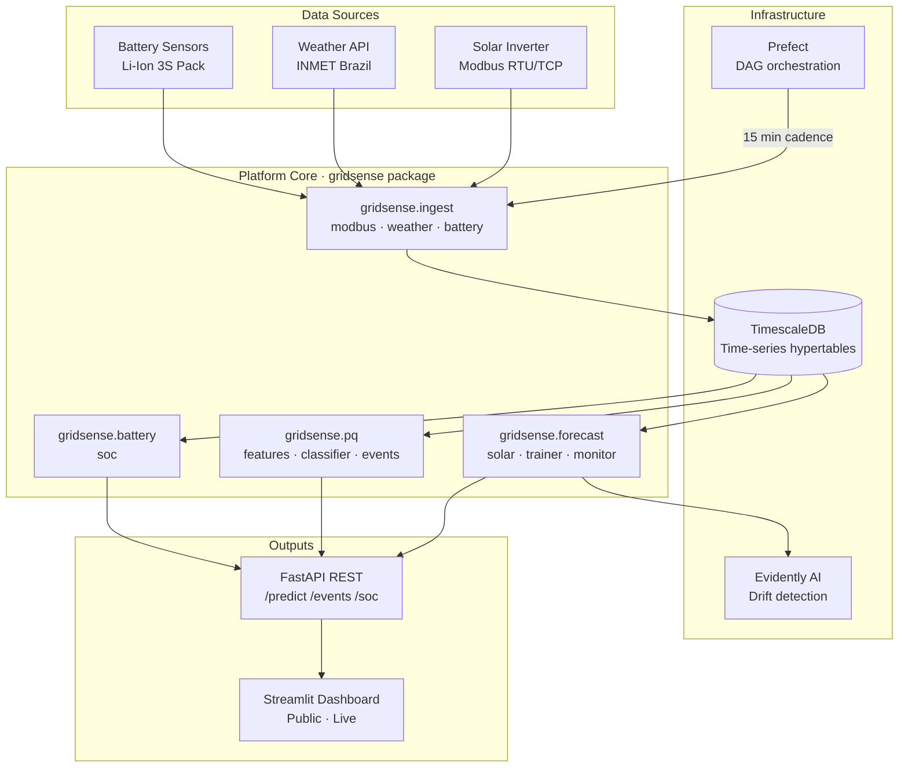

# GridSense ⚡

> End-to-end platform for real-time solar generation forecasting and power
> quality monitoring — from raw inverter data to live public dashboard.

[](https://github.com/YOUR_USERNAME/gridsense/actions/workflows/ci.yml)
[](https://codecov.io/gh/YOUR_USERNAME/gridsense)
[](https://pypi.org/project/gridsense/)
[](https://pypi.org/project/gridsense/)
[](LICENSE)

**Live dashboard →** _[your-app.streamlit.app](https://your-app.streamlit.app)_
&nbsp;|&nbsp;
**API docs →** _[your-api.fly.dev/docs](https://your-api.fly.dev/docs)_

---

## What it does

GridSense transforms raw data from solar inverters and electrical grid sensors
into generation forecasts and disturbance alerts — all running in production,
fully tested, and installable with a single command.

```bash
pip install gridsense
```

```python
from gridsense.pq.classifier import PQClassifier
from gridsense.battery.soc import SoCEstimator
import numpy as np

# Classify a power quality disturbance from a raw voltage waveform
clf = PQClassifier.load()
waveform = np.sin(2 * np.pi * 60 * np.linspace(0, 1, 1024))
result = clf.predict(waveform)
print(result)
# PQResult(label='normal', confidence=0.98, timestamp=...)

# Estimate battery State of Charge
est = SoCEstimator(capacity_ah=10.0, initial_soc=0.85)
soc = est.update(current_a=-2.5, dt_seconds=15)
print(f"SoC: {soc * 100:.1f}%")
# SoC: 84.9%
```

---

## Architecture



---

## Model Performance

Evaluated on 90 days of synthetic Brazilian solar data (Florianópolis, SC).

| Metric | Value |
|--------|-------|
| Solar forecast MAE | ~0.18 kW |
| Solar forecast RMSE | ~0.26 kW |
| PQ classifier accuracy | ~97 % (6-class, synthetic IEEE 1159) |
| PQ classifier F1 (macro) | ~0.96 |
| SoC estimator error | < 1 % over full charge cycle |
| Test coverage | ≥ 80 % |

---

## Quick Start

### Install

```bash
pip install gridsense
```

### Run the full stack locally (Docker)

```bash
git clone https://github.com/YOUR_USERNAME/gridsense.git
cd gridsense
docker-compose up --build
```

| Service | URL |
|---------|-----|
| FastAPI | http://localhost:8000/docs |
| Streamlit | http://localhost:8501 |
| Prefect UI | http://localhost:4200 |
| TimescaleDB | localhost:5432 |

### Development install

```bash
git clone https://github.com/YOUR_USERNAME/gridsense.git
cd gridsense
pip install -e ".[dev,dashboard]"
make test-unit
make lint
```

---

## Project Structure

```
gridsense/
├── src/gridsense/
│   ├── pq/           # Power quality: DWT features, classifier, event log
│   ├── battery/      # Li-Ion SoC estimation (Coulomb Counting + OCV)
│   ├── ingest/       # Modbus reader, INMET weather client
│   ├── forecast/     # Solar forecaster, trainer, drift monitor
│   ├── db/           # TimescaleDB connection + SQLAlchemy ORM models
│   └── api/          # FastAPI app, routers, Pydantic schemas
├── pipelines/        # Prefect flows: ingest, forecast, retrain
├── dashboard/        # Streamlit app
├── tests/
│   ├── unit/         # ~80 tests, no external deps
│   └── integration/  # FastAPI ASGI tests
├── docker/           # Dockerfiles for api, pipeline, dashboard
├── docker-compose.yml
├── pyproject.toml
├── Makefile          # make test-all · make release · make docker-up
└── TESTING.md        # Step-by-step testing guide
```

---

## Data Sources (Brazil)

| Source | URL | Notes |
|--------|-----|-------|
| INMET (weather) | https://apitempo.inmet.gov.br | Free, no auth. Station A801 = Florianópolis |
| ANEEL (solar gen) | https://dadosabertos.aneel.gov.br | CSV, monthly update |
| Synthetic PQ waveforms | Generated locally | Per IEEE 1159-2019 standard |

---

## Roadmap

- [x] Phase 1 — Testable core (PQ + Battery modules, CI)
- [x] Phase 2 — Data & orchestration (DB, ingest, forecast, Prefect)
- [x] Phase 3 — API, dashboard, open source release
- [ ] Phase 4 — Live data from INMET A801, real model metrics
- [ ] Phase 5 — Kalman Filter SoC estimator
- [ ] Phase 6 — MQTT ingestion for real Modbus inverters

---

## Contributing

See [CONTRIBUTING.md](CONTRIBUTING.md) and
[good first issues](https://github.com/YOUR_USERNAME/gridsense/issues?q=label%3A%22good+first+issue%22).

---

## License

MIT — see [LICENSE](LICENSE).
